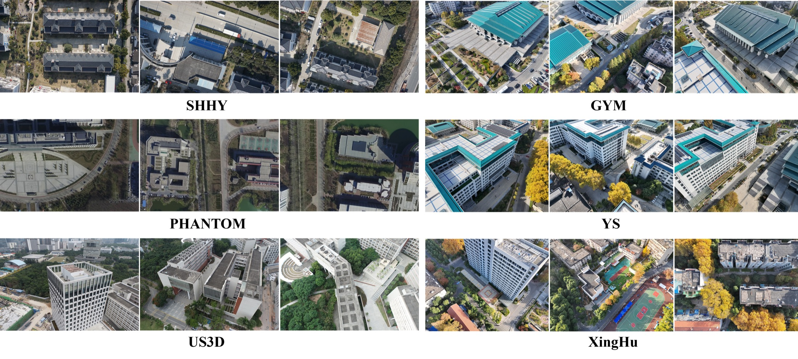

<h1 align="center">On-the-fly Feedback SfM: Online Explore-and-Exploit UAV Photogrammetry with Incremental Mesh Quality-Aware Indicator and Predictive Path Planning</h1>

<p align="center">
  Liyuan Lou<sup>†</sup>, Wanyun Li<sup>†</sup>, Wentian Gan<sup>†</sup>, Yifei Yu, Tengfei Wang, Xin Wang, <i>Member, IEEE</i>, Zongqian Zhan, <i>Member, IEEE</i>
</p>

<p align="center">
  <i>School of Geodesy and Geomatics, Wuhan University, Wuhan 430079, China</i><br/>
  <sup>†</sup> Equal contribution &nbsp;|&nbsp;
  Corresponding authors: <a href="mailto:xwang@sgg.whu.edu.cn">Xin Wang</a>, <a href="mailto:zqzhan@sgg.whu.edu.cn">Zongqian Zhan</a>
</p>

<p align="center">
  <a href="https://github.com/IRIS-LAB-whu">
    
  </a>
  &nbsp;
  <a href="https://arxiv.org/abs/2512.02375">
    
  </a>
  &nbsp;
  <a href="https://louliyuan.github.io/OntheflyFeedbackSfM_homepage/">
    
  </a>
</p>

**On-the-fly Feedback SfM** is an online explore-and-exploit UAV photogrammetry framework that tightly couples image acquisition, incremental reconstruction, mesh-quality assessment, and predictive path planning. Instead of reconstructing a scene only after a pre-planned flight is complete, the system evaluates the evolving 3D model during acquisition and feeds quality cues back to the UAV for adaptive data capture.

Built upon **[SfM on-the-fly](https://yifeiyu225.github.io/on-the-flySfMv2.github.io/)**, the framework processes small incoming image batches, updates camera poses and sparse structure, builds an incremental surface proxy, estimates per-face quality indicators, and plans new trajectory segments toward low-quality regions. This closes the loop from **acquisition → reconstruction → assessment → planning → re-acquisition** in near real time.


---

## Key Contributions

- **Online explore-and-exploit UAV photogrammetry.** We couple image acquisition, incremental reconstruction, quality assessment, and optimal path planning into a unified online workflow, allowing the UAV to adapt its flight path during the mission.

- **Incremental meshing with mesh quality-aware indicators.** A dynamic energy function, incremental ray tracing, and dynamic graph cuts reconstruct surfaces from a growing point cloud; the mesh then supports interpretable indicators including GSD, observation redundancy, and reprojection error.

- **Predictive path planning with quality-aware trajectory optimization.** Low-quality regions are identified from the ensemble indicator, grouped with DBSCAN, sampled under multi-constraint viewpoint generation, and optimized with an altitude-aware trajectory cost and 2-opt refinement.

---

## Framework Overview

The system follows an integrated **explore-and-exploit** working mode:

1. **SfM on-the-fly update.** Each incoming UAV image batch refines camera poses and expands the sparse point cloud without interrupting UAV motion.

2. **Incremental surface reconstruction.** The evolving sparse cloud is immediately converted into a triangular surface through dynamic 3D Delaunay updates, ray-based energy accumulation, and dynamic graph-cut optimization.

3. **Online quality assessment.** Per-face photogrammetric indicators are computed and fused into an ensemble quality score that exposes regions with poor imaging geometry, sparse observations, or high reprojection error.

4. **Predictive path planning.** Low-quality regions guide candidate viewpoint generation, viewpoint sparsification, and smooth trajectory optimization; the resulting segment is executed before the next image batch arrives.

Each small batch, typically 5-20 images, triggers one complete feedback cycle of reconstruction, quality assessment, and trajectory update.

---

## Datasets

We evaluate our method on the following UAV datasets:

| Dataset | Images | Platform | Resolution | Source |
|---------|--------|----------|------------|--------|
| SHHY | 770 | DJI Mavic 2 Pro | 1920×1080 | Self-captured |
| PHANTOM | 467 | DJI Mavic 2 Pro | 1920×1080 | [Bu et al., 2016](https://ieeexplore.ieee.org/abstract/document/7759672) |
| US3D | 990 | — | 5472×3648 | [Lin et al., 2022](https://link.springer.com/chapter/10.1007/978-3-031-20074-8_6) |
| GYM | 580 | DJI Matrice 4T | 4032×3024 | Self-captured |
| YS | 320 | DJI Matrice 4T | 4032×3024 | Self-captured |
| XingHu | — | DJI Matrice 4T | 4032×3024 | Self-captured |

<p align="center">
  
</p>

<p align="center"><em>Sample images of the evaluated UAV datasets.</em></p>

## Experimental Results

We evaluate the framework from four complementary perspectives: incremental surface reconstruction, online mesh-quality assessment, adaptive path planning, and the full explore-and-exploit feedback pipeline. All experiments are run on a machine with an Intel i9-12900K CPU and an NVIDIA RTX3080 GPU.

### Surface Reconstruction Quality

Quantitative comparison of surface reconstruction quality. **Bold** indicates the best value in each dataset group.

| Dataset | Method | Accuracy | Completeness | F1 Score |
|---------|--------|----------|--------------|----------|
| SHHY | COLMAP | 0.4970 | **0.4771** | 0.4868 |
| SHHY | OpenMVG | **0.7270** | 0.3633 | 0.4845 |
| SHHY | Ours | 0.6509 | 0.4527 | **0.5340** |
| GYM | COLMAP | 0.7793 | **0.6092** | **0.6838** |
| GYM | OpenMVG | 0.7363 | 0.4937 | 0.5911 |
| GYM | Ours | **0.8001** | 0.5958 | 0.6830 |
| YS | COLMAP | 0.7042 | **0.5755** | **0.6334** |
| YS | OpenMVG | 0.7054 | 0.4672 | 0.5621 |
| YS | Ours | **0.7271** | 0.5533 | 0.6284 |

### Online Quality Assessment

The ensemble mesh-quality indicator `Q_total` reflects both geometric and observational completeness. On PHANTOM, regions with stronger observation redundancy consistently appear as higher-quality areas, while sparse or weakly observed regions are assigned lower scores. On US3D, the indicator captures local quality evolution in complex rooftop structures as additional images are integrated.

### Adaptive Path Planning

On the US3D benchmark, the proposed strategy reallocates viewpoints toward detected low-quality regions while keeping planning responsive enough for online operation.

| Method | Viewpoints | Trajectory Length | Generation Time |
|--------|------------|-------------------|-----------------|
| Smith et al. | 230 | 387.86 | Offline |
| Circle | 66 | 1867.03 | Manually designed |
| Nadir | 64 | 1783.99 | Manually designed |
| Ours | 120 | 947.43 | 744.342 ms |

### Online Feedback Pipeline

On the self-captured XingHu dataset, the full pipeline updates reconstruction, quality assessment, and trajectory planning in near real time. The average processing time remains around 1.4-1.5 seconds per image, and trajectory generation remains below one second across online iterations.

| Stage | Accuracy | Completeness | F1 Score | Avg. Time / Image | Trajectory Generation |
|-------|----------|--------------|----------|-------------------|-----------------------|
| Iteration 1 | 0.6764 | 0.4143 | 0.5138 | 1.465 s | 602.311 ms |
| Iteration 2 | 0.8333 | 0.5232 | 0.6428 | 1.470 s | 183.801 ms |
| Iteration 3 | 0.8141 | 0.4830 | 0.6063 | 1.415 s | 497.513 ms |
| Final | 0.8291 | 0.5099 | 0.6315 | 1.475 s | - |

---

## Install Instructions

## Prerequisites

> **Platform: Windows only** (requires Visual Studio 2022)

> **Recommended hardware:** Intel i9-12900K CPU, NVIDIA RTX3080; **Minimum GPU:** NVIDIA GTX 1080 Ti, CUDA 12.2

This project is built upon **[SfM on-the-fly](https://www.sciencedirect.com/science/article/abs/pii/S0924271625001388)** (Zhan et al., ISPRS Journal of Photogrammetry and Remote Sensing, 2025). Please ensure you are familiar with its setup before proceeding.

## Environment Setup

* Visual Studio 2022 (v17.9.1 recommended)
* Qt 5.12.12 (Core, Gui, OpenGL, Widgets)
* CUDA 12.2
* VCPKG

  * Run `vcpkg integrate install`
  * Install C++ dependencies via `vcpkg install`
* Intel® oneAPI Threading Building Blocks (TBB)
* Python environment

  * Install PyTorch:

    ```bash
    pip install torch==2.2.2 torchvision==0.17.2 torchaudio==2.2.2 --index-url https://download.pytorch.org/whl/cu118
    ```
  * Install dependencies:

    ```bash
    pip install -r requirements.txt
    ```
  * Install `deep-image-matching`

## Build Instructions

### Build Order

Please strictly follow the order below to ensure correct dependency linking:

#### Third-party Libraries (`thirdparty`)

* SIFTGPU
* VLFeat

#### Internal Modules

* Base
* Geometry
* Scene
* Estimator
* Feature
* Workflow
* UI

---

## Citation

If you find this work useful in your research, please consider citing:

```bibtex
@misc{lou2025ontheflyfeedbacksfm,
  title={On-the-fly Feedback SfM: Online Explore-and-Exploit UAV Photogrammetry with Incremental Mesh Quality-Aware Indicator and Predictive Path Planning},
  author={Liyuan Lou and Wanyun Li and Wentian Gan and Yifei Yu and Tengfei Wang and Xin Wang and Zongqian Zhan},
  year={2025},
  eprint={2512.02375},
  archivePrefix={arXiv},
  primaryClass={cs.CV},
  doi={10.48550/arXiv.2512.02375},
  url={https://arxiv.org/abs/2512.02375}
}
```

---

## Acknowledgments                                                                                                                                         
                                                                        
This work was supported by the National Natural Science Foundation of China (No. 42301507) and the Luojia Undergraduate Innovation Research Fund of Wuhan  
University.                                                             
                                                                                                                                                           
**Corresponding authors:** Xin Wang (xwang@sgg.whu.edu.cn) and Zongqian Zhan (zqzhan@sgg.whu.edu.cn)
